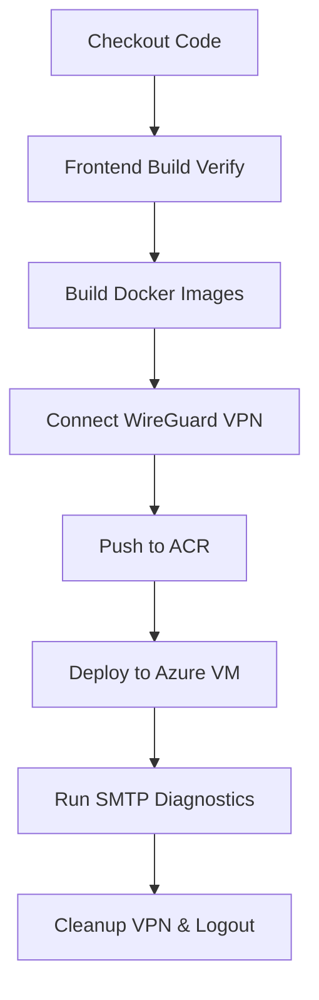

# CampusFind - Lost & Found Management System & DevOps CI/CD Guide

CampusFind is a robust MERN-stack (MongoDB, Express, React, Node) application designed for campus-wide lost and found management. This guide provides a step-by-step walkthrough to build, configure, and host the application, detailing everything from Azure Virtual Machine provisioning to Jenkins CI/CD pipeline deployment.

---

## 1. Virtual Machine (VM) Provisioning & Setup

To host the applications concurrently, we provisioned and configured an Azure Ubuntu Virtual Machine.

### Step 1.1: Provision the VM on Azure
1. Log in to the [Azure Portal](https://portal.azure.com/).
2. Click **Create a resource** > **Virtual Machine**.
3. Configure the VM Details:
   - **OS Image**: `Ubuntu Server 22.04 LTS - x64`
   - **Size**: Standard `B2s` (2 vCPUs, 4 GiB memory) is recommended for running multiple compose stacks.
   - **Authentication**: Select **SSH public key** to ensure secure logins.
4. Go to **Networking** and enable a public IP (e.g., `40.81.226.88`).

### Step 1.2: Configure Network Security Group (NSG) Inbound Rules
Go to **Networking > Inbound port rules** in your Azure VM console and add the following rules:

| Rule Name | Port | Protocol | Source / Destination | Action | Description |
|---|---|---|---|---|---|
| `SSH` | `22` | TCP | Any / Any | **Allow** | Management CLI Access |
| `WireGuard` | `51820` | UDP | Any / Any | **Allow** | VPN Tunnel Connection |
| `Task-Manager` | `8080` | TCP | Any / Any | **Allow** | Task Manager App Access |
| `CampusFind` | `8081` | TCP | Any / Any | **Allow** | CampusFind App Access |

### Step 1.3: Install Docker Engine on Ubuntu VM
Connect to your VM via SSH and install Docker:
```bash
# Update package list and install prerequisites
sudo apt-get update
sudo apt-get install -y apt-transport-https ca-certificates curl software-properties-common gnupg lsb-release

# Add Docker's official GPG key and repository
sudo mkdir -p /etc/apt/keyrings
curl -fsSL https://download.docker.com/linux/ubuntu/gpg | sudo gpg --dearmor -o /etc/apt/keyrings/docker.gpg
echo "deb [arch=$(dpkg --print-architecture) signed-by=/etc/apt/keyrings/docker.gpg] https://download.docker.com/linux/ubuntu $(lsb_release -cs) stable" | sudo tee /etc/apt/sources.list.d/docker.list > /dev/null

# Install Docker and Docker Compose
sudo apt-get update
sudo apt-get install -y docker-ce docker-ce-cli containerd.io docker-compose-plugin

# Enable and start Docker service
sudo systemctl enable docker
sudo systemctl start docker

# Add your user to the docker group
sudo usermod -aG docker $USER
newgrp docker
```

---

## 2. WireGuard VPN Tunnel Configuration

To connect the Windows build machine (Jenkins) to the private Azure network without exposing management tools (like Docker ports and SSH keys) to the public internet, we configure a secure WireGuard VPN.

### Step 2.1: Configure WireGuard Server (Azure VM)
1. Install WireGuard on the VM:
   ```bash
   sudo apt-get update
   sudo apt-get install -y wireguard
   ```
2. Generate private and public keys:
   ```bash
   cd /etc/wireguard
   umask 077
   wg genkey | tee privatekey | wg pubkey > publickey
   ```
3. Create the Server Configuration file `/etc/wireguard/wg0.conf`:
   ```ini
   [Interface]
   PrivateKey = <insert-server-private-key>
   Address = 10.8.0.1/24
   ListenPort = 51820

   # Client Connection Definition
   [Peer]
   PublicKey = <insert-client-public-key-from-jenkins-machine>
   AllowedIPs = 10.8.0.2/32
   ```
4. Start the WireGuard Server interface:
   ```bash
   sudo wg-quick up wg0
   sudo systemctl enable wg-quick@wg0
   ```

### Step 2.2: Configure WireGuard Client (Jenkins Windows Machine)
1. Download and install [WireGuard for Windows](https://www.wireguard.com/install/).
2. Open the WireGuard GUI, generate a keypair, and create a client configuration file (`wg0.conf`):
   ```ini
   [Interface]
   PrivateKey = <insert-client-private-key>
   Address = 10.8.0.2/24
   DNS = 1.1.1.1

   [Peer]
   PublicKey = <insert-server-public-key-from-vm>
   Endpoint = 40.81.226.88:51820
   AllowedIPs = 10.8.0.0/24
   PersistentKeepalive = 25
   ```
3. Save this client config. We will upload this config to Jenkins credentials to automate the VPN connection.

---

## 3. Jenkins Agent Environment & Credentials Setup

The Jenkins server must be installed with dependencies to build React files, compile container images, and communicate with the VM.

### Step 3.1: Build Agent Requirements
Install the following software on the machine running the Jenkins controller/agent:
1. **Node.js (v20+)** - Used to test and verify builds locally.
2. **Docker Desktop** - Used to compile, build, and push Docker images.
3. **WireGuard Client CLI** - Installs to `C:\Program Files\WireGuard\wireguard.exe` to manage the VPN tunnel dynamically.

### Step 3.2: Configure Secure Jenkins Credentials
Open Jenkins, go to **Manage Jenkins > Credentials > System > Global credentials**, and add the following keys:

| Credential ID | Kind | Value / Action |
|---|---|---|
| `taskflowregistry-acr-creds` | Username with Password | Azure Container Registry (ACR) credentials. |
| `azure-vm-ssh-creds` | SSH Username with private key | SSH private key file used to deploy to the Azure VM (username: `azureuser`). |
| `wireguard-config` | Secret file | Upload the client **`wg0.conf`** WireGuard configuration file. |
| `campusfind-prod-env` | Secret file | Upload your production **`.env`** configuration file containing backend environment variables. |

---

## 4. Multi-Application Deployment Directories

To ensure that both MERN stacks can run simultaneously on the Azure VM host, they are separated into distinct subfolders under the `/home/azureuser` home folder:

```text
/home/azureuser/
├── task-manager/        <-- Task Manager Compose stack (Port 8080)
│   ├── docker-compose.yml
│   └── .env
└── campus-find/         <-- CampusFind Compose stack (Port 8081)
    ├── docker-compose.yml
    └── .env
```

By deploying into separate folders, we prevent Docker Compose configurations from overwriting each other or turning off each other's containers via `--remove-orphans`.

---

## 5. Declarative Jenkins Pipeline Execution

The [Jenkinsfile](file:///c:/RV/1-SEM/CampusFind/Jenkinsfile) automates the entire CI/CD sequence.

### Pipeline Stage Details



1. **Checkout**: Checks out the code from GitHub.
2. **Frontend Build Verification**: Installs packages and runs `npm run build` using Vite.
3. **Build Docker Images**: Builds multi-stage production Docker images (`campusfind-backend:latest` and `campusfind-frontend:latest`).
4. **Connect WireGuard VPN**:
   - Force-uninstalls any stale `wg0` Windows service instance to prevent VPN socket locks:
     `wireguard.exe /uninstalltunnelservice wg0`
   - Installs and starts the tunnel service using the secure credential configuration file:
     `wireguard.exe /installtunnelservice C:\workspace\wg0.conf`
5. **Push to Azure ACR**: Logs into Azure Container Registry and pushes the compiled images.
6. **Deploy to Azure VM**:
   - Stops and removes any outdated root-level container namespaces to avoid naming conflicts on the VM.
   - Securely transfers `docker-compose.prod.yml` and the `.env` file to `/home/azureuser/campus-find/` using SCP.
   - Logs into the registry on the VM, pulls the fresh images, and runs `docker compose up -d`.
   - Automatically executes the database seeding script (`node setup.js`) to generate initial accounts.
7. **Post Actions (Cleanup)**: Stops/uninstalls the WireGuard VPN tunnel, logs out of ACR, and runs image pruning on the remote VM to reclaim storage.

---

## 📂 Local Development Setup

To run CampusFind locally on your computer:

1. Create a `backend/.env` file with these values:
   ```env
   NODE_ENV=development
   PORT=5000
   MONGODB_URI=mongodb://mongodb:27017/campusfind
   JWT_SECRET=your_jwt_secret_key
   JWT_EXPIRE=24h
   ADMIN_ACCOUNTS='[{"email":"admin@rvce.edu.in","password":"StrongPassword123!"}]'
   ```
2. Start the local multi-container composition:
   ```bash
   docker compose up --build
   ```
3. Access the web app at **`http://localhost:8081`**. The React application uses a dev-proxy defined in `vite.config.js` to route all `/api` and `/uploads` requests automatically.

---

## 🛡️ Sandbox & Testing Helpers

To facilitate manual testing and demo runs, the application has two special developer workflows built in:

### 1. Database Auto-Seeding
When the backend service starts, it automatically executes `node setup.js` to check the `ADMIN_ACCOUNTS` array inside the `.env` file and creates the accounts if they do not exist.
- **Default Admin Account**:
  - **Email**: `admin@rvce.edu.in`
  - **Password**: `StrongPassword123!`

### 2. Universal OTP Bypass
Since Gmail/SMTP networks are often blocked in sandbox environments or require app passwords, the OTP verification service is configured with a bypass code:
- Register any user ending in `@rvce.edu.in`.
- When prompted for the OTP code, enter **`123456`**. Verification will succeed instantly!
