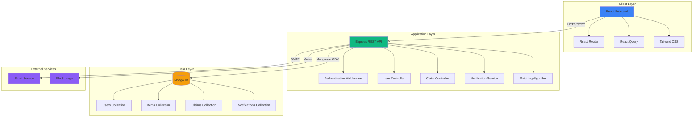
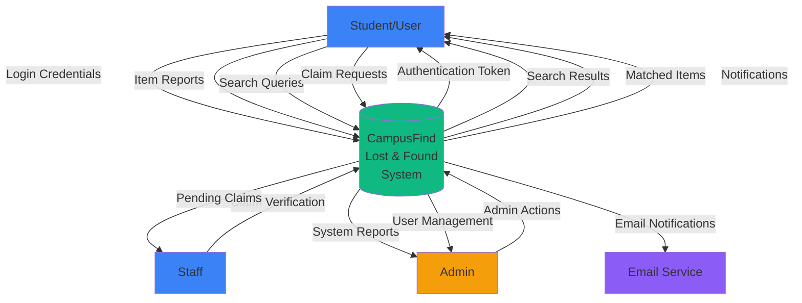
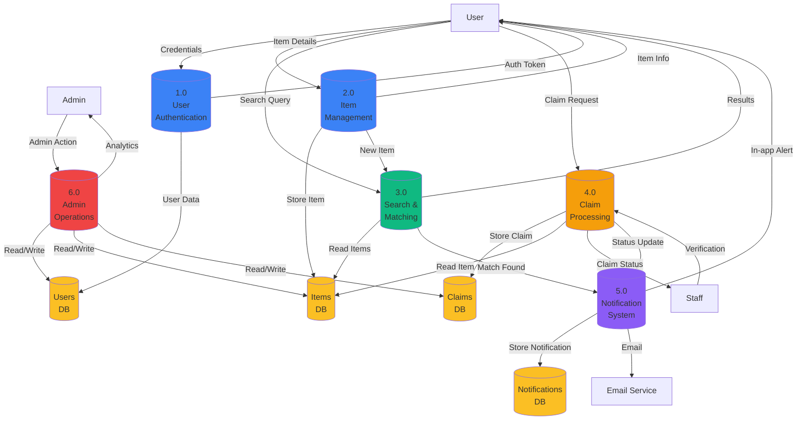
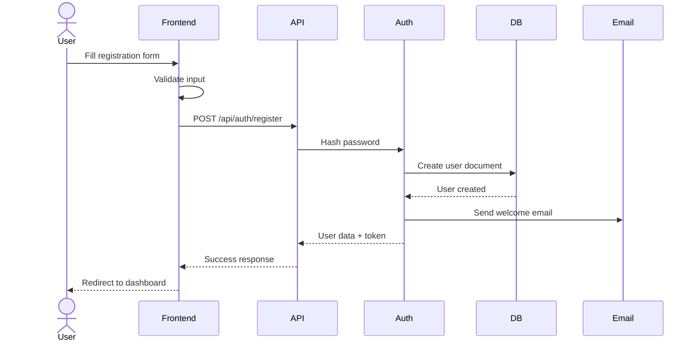
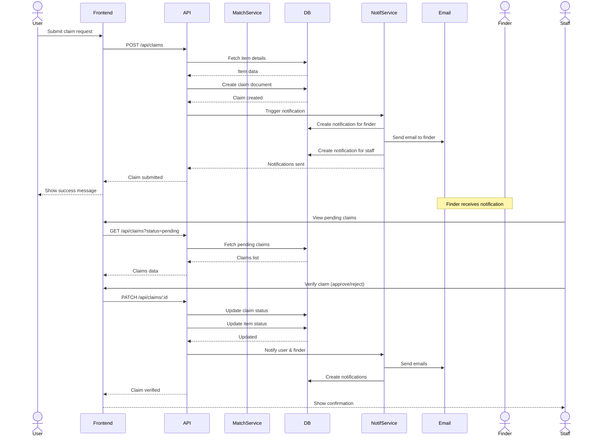
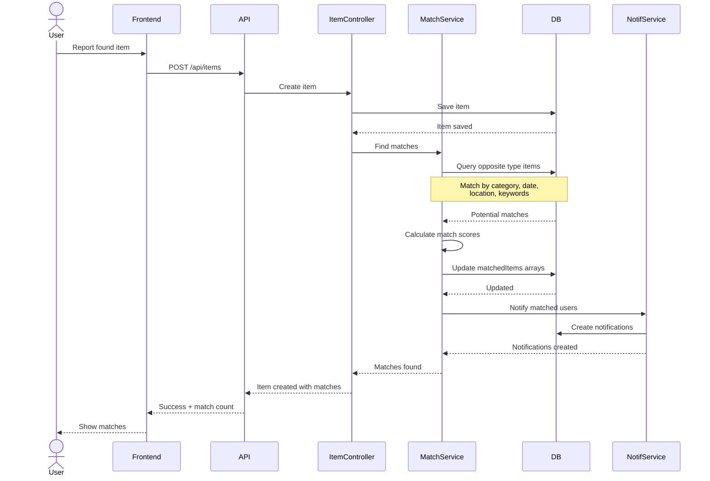
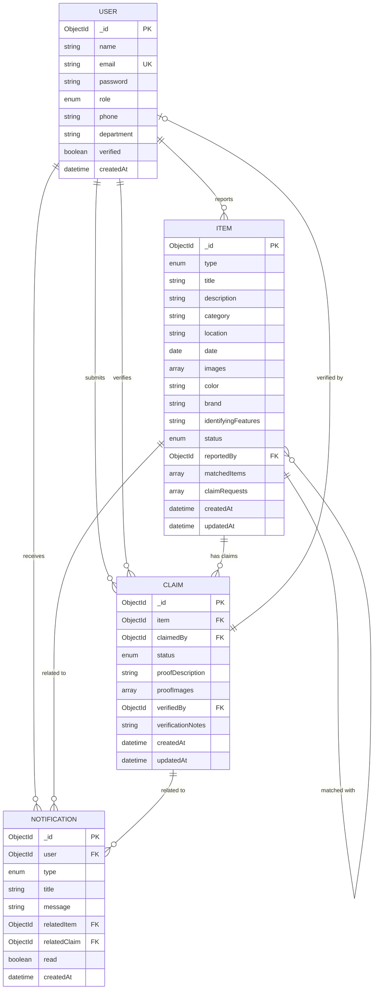
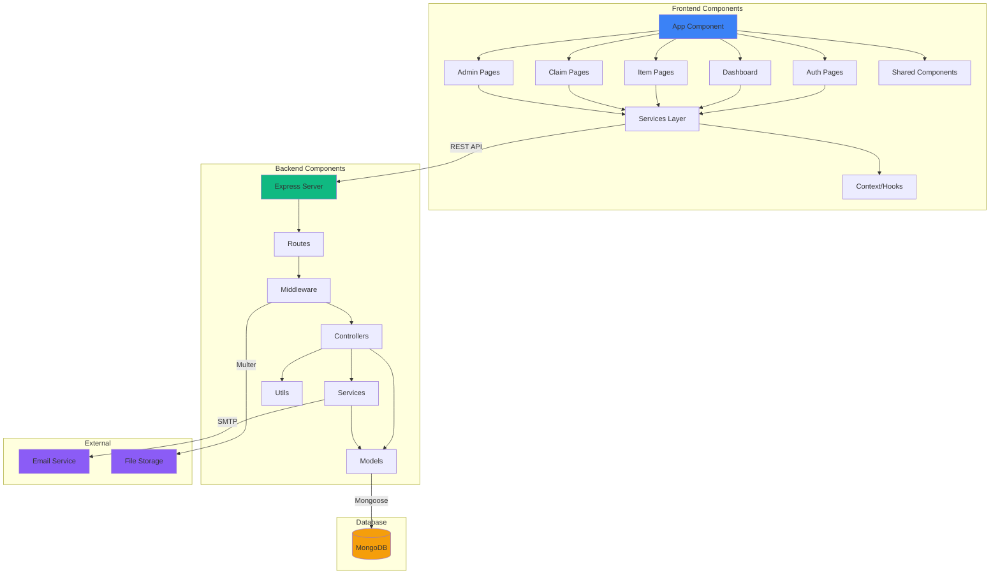

# CampusFind: System Design Documentation

## Table of Contents
1. [System Architecture](#system-architecture)
2. [Use Case Diagram](#use-case-diagram)
3. [Data Flow Diagrams](#data-flow-diagrams)
4. [Sequence Diagrams](#sequence-diagrams)
5. [Entity-Relationship Diagram](#entity-relationship-diagram)
6. [Component Diagram](#component-diagram)

---

## System Architecture

The CampusFind system follows a three-tier architecture pattern:

### Architecture Components

**Client Layer (Frontend)**
- **React**: Component-based UI framework
- **React Router**: Client-side routing and navigation
- **React Query**: Server state management and caching
- **Tailwind CSS**: Utility-first CSS framework
- **Axios**: HTTP client for API communication

**Application Layer (Backend)**
- **Express.js**: Web application framework
- **JWT Authentication**: Secure token-based authentication
- **Controllers**: Handle business logic for each resource
- **Services**: Reusable business logic (matching, notifications)
- **Middleware**: Authentication, validation, error handling
- **Multer**: File upload handling

**Data Layer**
- **MongoDB**: NoSQL document database
- **Mongoose**: ODM for schema validation and queries
- **Collections**: Users, Items, Claims, Notifications

**External Services**
- **Email Service**: Nodemailer with SMTP for notifications
- **File Storage**: Local file system for uploaded images

---

## Use Case Diagram

```mermaid
graph LR
    subgraph Actors
        U[Student/User]
        S[Staff]
        A[Admin]
    end
    
    subgraph "Authentication"
        UC1((Register))
        UC2((Login))
        UC3((Logout))
    end
    
    subgraph "Item Management"
        UC4((Report Lost Item))
        UC5((Report Found Item))
        UC6((Search Items))
        UC7((View Item Details))
        UC8((Edit My Item))
        UC9((Delete My Item))
    end
    
    subgraph "Matching & Claims"
        UC10((View Matches))
        UC11((Submit Claim))
        UC12((Track My Claims))
        UC13((Verify Claim))
    end
    
    subgraph "Notifications"
        UC14((View Notifications))
        UC15((Receive Email Alerts))
    end
    
    subgraph "Admin Functions"
        UC16((Manage Users))
        UC17((Moderate Items))
        UC18((View Analytics))
        UC19((System Settings))
    end
    
    U --> UC1
    U --> UC2
    U --> UC3
    U --> UC4
    U --> UC5
    U --> UC6
    U --> UC7
    U --> UC8
    U --> UC9
    U --> UC10
    U --> UC11
    U --> UC12
    U --> UC14
    U --> UC15
    
    S --> UC1
    S --> UC2
    S --> UC3
    S --> UC4
    S --> UC5
    S --> UC6
    S --> UC7
    S --> UC8
    S --> UC9
    S --> UC10
    S --> UC11
    S --> UC12
    S --> UC13
    S --> UC14
    S --> UC15
    
    A --> UC1
    A --> UC2
    A --> UC3
    A --> UC4
    A --> UC5
    A --> UC6
    A --> UC7
    A --> UC8
    A --> UC9
    A --> UC10
    A --> UC11
    A --> UC12
    A --> UC13
    A --> UC14
    A --> UC15
    A --> UC16
    A --> UC17
    A --> UC18
    A --> UC19
    
    style U fill:#3b82f6
    style S fill:#10b981
    style A fill:#f59e0b
```

### Use Case Descriptions

| Use Case | Actor | Description |
|----------|-------|-------------|
| Register | All | Create a new account with email and password |
| Login | All | Authenticate and receive JWT token |
| Report Lost Item | All | Submit details of a lost item with images |
| Report Found Item | All | Submit details of a found item with images |
| Search Items | All | Search and filter items by various criteria |
| View Matches | All | See automatically matched lost/found items |
| Submit Claim | All | Request to claim a found item |
| Verify Claim | Staff/Admin | Approve or reject claim requests |
| Manage Users | Admin | View, edit, and manage user accounts |
| Moderate Items | Admin | Review, archive, or delete reported items |
| View Analytics | Admin | Access dashboard with system statistics |

---

## Data Flow Diagrams

### DFD Level 0 (Context Diagram)

### DFD Level 1 (Detailed Processes)

---

## Sequence Diagrams

### User Registration Flow

### Lost Item Claim Workflow

### Auto-Matching Algorithm Flow

---

## Entity-Relationship Diagram

### Database Schema Details

#### Users Collection
- **Primary Key**: `_id` (ObjectId)
- **Unique Index**: `email`
- **Indexes**: `role`, `createdAt`
- **Relationships**: One-to-many with Items, Claims, Notifications

#### Items Collection
- **Primary Key**: `_id` (ObjectId)
- **Indexes**: `type`, `category`, `status`, `reportedBy`, `createdAt`
- **Relationships**: 
  - Many-to-one with User (reportedBy)
  - Many-to-many with Item (matchedItems - self-referencing)
  - One-to-many with Claim

#### Claims Collection
- **Primary Key**: `_id` (ObjectId)
- **Indexes**: `item`, `claimedBy`, `status`, `verifiedBy`, `createdAt`
- **Relationships**:
  - Many-to-one with Item
  - Many-to-one with User (claimedBy)
  - Many-to-one with User (verifiedBy)

#### Notifications Collection
- **Primary Key**: `_id` (ObjectId)
- **Indexes**: `user`, `read`, `createdAt`
- **Relationships**:
  - Many-to-one with User
  - Many-to-one with Item (optional)
  - Many-to-one with Claim (optional)

---

## Component Diagram

### Component Responsibilities

**Frontend Components**
- **App Component**: Root component, routing setup
- **Auth Pages**: Login, register, password reset
- **Dashboard**: Role-based dashboard views
- **Item Pages**: Report, list, detail, edit items
- **Claim Pages**: Submit, track, verify claims
- **Admin Pages**: User management, moderation, analytics
- **Shared Components**: Navbar, notifications, cards, modals
- **Services Layer**: API communication, data fetching
- **Context/Hooks**: Authentication state, custom hooks

**Backend Components**
- **Express Server**: Application entry point, middleware setup
- **Routes**: API endpoint definitions
- **Middleware**: Authentication, validation, error handling
- **Controllers**: Request handling, response formatting
- **Services**: Business logic (matching, notifications)
- **Models**: Mongoose schemas and methods
- **Utils**: Helper functions, constants

---

## Technology Stack Summary

| Layer | Technology | Purpose |
|-------|-----------|---------|
| **Frontend** | React 18 | UI framework |
| | Vite | Build tool and dev server |
| | React Router v6 | Client-side routing |
| | React Query | Server state management |
| | Tailwind CSS | Styling framework |
| | Axios | HTTP client |
| **Backend** | Node.js | Runtime environment |
| | Express.js | Web framework |
| | Mongoose | MongoDB ODM |
| | JWT | Authentication |
| | Bcrypt | Password hashing |
| | Multer | File uploads |
| | Nodemailer | Email service |
| **Database** | MongoDB | NoSQL database |
| **DevOps** | Nodemon | Auto-restart server |
| | ESLint | Code linting |
| | Prettier | Code formatting |

---

## Security Considerations

1. **Authentication**
   - JWT tokens with expiration
   - Password hashing with bcrypt (10 rounds)
   - HTTP-only cookies (optional)

2. **Authorization**
   - Role-based access control (RBAC)
   - Middleware to protect routes
   - Resource ownership validation

3. **Input Validation**
   - Request body validation
   - File type and size restrictions
   - SQL injection prevention (MongoDB)
   - XSS prevention

4. **Data Privacy**
   - Sensitive data encryption
   - Secure password storage
   - Email masking in public views
   - CORS configuration

5. **API Security**
   - Rate limiting (optional)
   - HTTPS in production
   - Environment variable protection
   - Error message sanitization

---

## Scalability Considerations

1. **Database**
   - Proper indexing for frequent queries
   - Pagination for large datasets
   - Aggregation pipelines for analytics

2. **Caching**
   - Redis for session storage (future)
   - Client-side caching with React Query
   - Static asset caching

3. **File Storage**
   - Image compression before upload
   - CDN integration (future)
   - Lazy loading for images

4. **Performance**
   - Code splitting in React
   - Lazy loading of routes
   - Optimized database queries
   - Response compression

---

This system design provides a comprehensive blueprint for the CampusFind Lost & Found Management System, ensuring scalability, security, and maintainability while meeting all functional and non-functional requirements.
