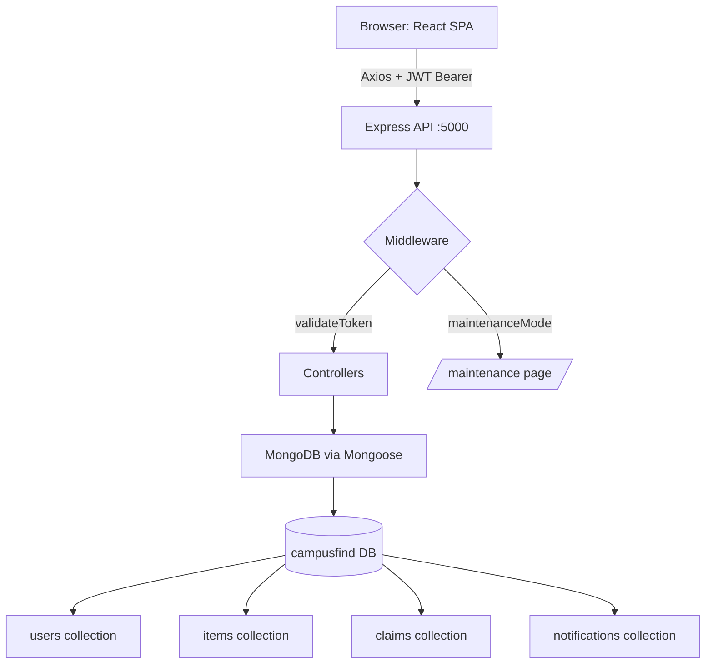

# CampusFind: Detailed Component Walkthrough

A deep-dive into every layer of the CampusFind project — with code explanations.

---

## 🏗️ Architecture Overview

```
CampusFind/
├── frontend/                      ← React + Vite + TailwindCSS SPA
│   └── src/
│       ├── App.jsx                ← Root: routing & providers
│       ├── main.jsx               ← Entry point
│       ├── context/               ← Global state (Auth, Theme)
│       ├── hooks/                 ← Custom React hooks
│       ├── components/            ← Reusable UI components (15)
│       ├── pages/                 ← Full-page views (18)
│       ├── services/              ← API call functions (6)
│       └── utils/                 ← Helpers (date, image, etc.)
└── backend/                       ← Node.js + Express REST API
    ├── server.js                  ← Entry point, middleware setup
    ├── models/                    ← MongoDB/Mongoose schemas (7)
    ├── controllers/               ← Business logic handlers
    ├── routes/                    ← API endpoint definitions (5)
    ├── middleware/                ← Auth, errors, maintenance
    └── services/                  ← Business services (email, matching)
```

---

## 1. Entry Point: `App.jsx`

This is the root of the entire frontend. It wires together all the providers and the page router.

```jsx
// App.jsx
function App() {
  return (
    <ThemeProvider>           {/* 1. Dark/Light mode context */}
      <QueryClientProvider>  {/* 2. React Query (data fetching) */}
        <AuthProvider>       {/* 3. Auth context (logged-in user) */}
          <Router>           {/* 4. Browser routing */}
            <Toaster />      {/* 5. Global toast notifications */}
            <Navbar />       {/* 6. Persistent top navbar */}
            <Routes>         {/* 7. Page switching */}
              {/* Public routes */}
              <Route path="/" element={<Home />} />
              <Route path="/items" element={<ItemList />} />

              {/* Protected routes (login required) */}
              <Route path="/dashboard" element={
                <ProtectedRoute><Dashboard /></ProtectedRoute>
              } />

              {/* Role-restricted routes */}
              <Route path="/verify-claims" element={
                <ProtectedRoute requiredRole={['staff', 'admin']}>
                  <VerifyClaims />
                </ProtectedRoute>
              } />
              <Route path="/admin" element={
                <ProtectedRoute requiredRole="admin">
                  <AdminDashboard />
                </ProtectedRoute>
              } />
            </Routes>
          </Router>
        </AuthProvider>
      </QueryClientProvider>
    </ThemeProvider>
  );
}
```

**Key points:**
- **Maintenance check**: On mount, `App` pings `/api/health`. If the server returns 503, the API interceptor redirects non-admins to the `/maintenance` page.
- **Provider nesting**: ThemeProvider → QueryClientProvider → AuthProvider. Each provides a piece of global state to all child components.
- **Route protection**: `ProtectedRoute` wraps sensitive pages. Unauthenticated users are sent to `/login`.

---

## 2. Context Providers

### `AuthContext.jsx`
Manages the global logged-in user state.

```jsx
// context/AuthContext.jsx
export const AuthProvider = ({ children }) => {
    const [user, setUser] = useState(null);
    const [loading, setLoading] = useState(true);

    useEffect(() => {
        // On app load, restore user from localStorage
        if (isAuthenticated()) {
            setUser(getCurrentUser()); // reads from localStorage
        }
        setLoading(false);
    }, []);

    const login = (userData) => setUser(userData);

    const logout = () => {
        setUser(null);
        authLogout(); // clears localStorage + redirects to /login
    };

    const updateUser = (userData) => {
        setUser(userData);
        localStorage.setItem('user', JSON.stringify(userData)); // persist changes
    };

    // Provide user, login, logout, updateUser to all children
    return <AuthContext.Provider value={{ user, login, logout, updateUser, loading }}>
        {children}
    </AuthContext.Provider>;
};
```

**How it works:**
- The user object and JWT token are stored in `localStorage` after login.
- On every page refresh, `AuthProvider` reads from `localStorage` to restore the session.
- `updateUser` is used by the Profile page when the user saves changes.
- Any component can use `const { user, logout } = useAuth()` to access this.

### `ThemeContext.jsx`
Handles dark/light mode switching.

```jsx
// context/ThemeContext.jsx
export const ThemeProvider = ({ children }) => {
    const [theme, setTheme] = useState(() => {
        // On first load: check localStorage, then system preference
        const saved = localStorage.getItem('theme');
        if (saved) return saved;
        return window.matchMedia('(prefers-color-scheme: dark)').matches ? 'dark' : 'light';
    });

    useEffect(() => {
        // Add/remove 'dark' class on <html> tag to activate Tailwind dark styles
        document.documentElement.classList.toggle('dark', theme === 'dark');
        localStorage.setItem('theme', theme); // persist preference
    }, [theme]);

    const toggleTheme = () => setTheme(prev => prev === 'light' ? 'dark' : 'light');

    return <ThemeContext.Provider value={{ theme, toggleTheme }}>
        {children}
    </ThemeContext.Provider>;
};
```

---

## 3. API Layer: `services/api.js`

The single Axios instance used by every service.

```javascript
// services/api.js
const api = axios.create({
    baseURL: 'http://localhost:5000/api',
});

// REQUEST INTERCEPTOR: attach JWT token to every outgoing request
api.interceptors.request.use((config) => {
    const token = localStorage.getItem('token');
    if (token) {
        config.headers.Authorization = `Bearer ${token}`;
    }
    return config;
});

// RESPONSE INTERCEPTOR: handle global errors
api.interceptors.response.use(
    (response) => response, // pass-through on success
    (error) => {
        if (error.response?.status === 401) {
            // Token expired/invalid → clear storage and redirect to login
            // (Only if NOT already on login page)
            if (!isLoginPage && !isLoginRequest) {
                localStorage.removeItem('token');
                window.location.href = '/login';
            }
        }
        if (error.response?.status === 503 && error.response.data.isMaintenance) {
            // Server in maintenance → redirect non-admins to /maintenance
            if (user.role !== 'admin') window.location.href = '/maintenance';
        }
        return Promise.reject(error);
    }
);
```

**Why this matters:**
- You never manually add `Authorization: Bearer ...` headers in your components.
- Expired sessions are automatically handled everywhere in the app.

---

## 4. Service Files

These functions are the only place API calls happen. Components never call `axios` directly.

### `authService.js`

| Function | API Call | What it does |
|---|---|---|
| `register(userData)` | `POST /auth/register` | Create account, triggers OTP email |
| `verifyOtp(email, otp)` | `POST /auth/verify-otp` | Confirms OTP, receives JWT token |
| `login(credentials)` | `POST /auth/login` | Logs in, stores token + user |
| `logout()` | — | Clears localStorage, redirects to `/login` |
| `forgotPassword(email)` | `POST /auth/forgot-password` | Sends OTP for password reset |
| `updateProfile(data)` | `PUT /auth/profile` | Updates name, phone, dept |
| `changePassword(data)` | `PUT /auth/change-password` | Changes password (old + new required) |
| `updateProfilePicture(formData)` | `PUT /auth/profile/picture` | Uploads new profile photo |
| `deleteAccount(pass, otp)` | `DELETE /auth/me` | Deletes account after OTP confirmation |

### `itemService.js`

| Function | API Call | What it does |
|---|---|---|
| `getItems(filters)` | `GET /items?type=lost&category=...` | Fetches filtered item list |
| `getItemById(id)` | `GET /items/:id` | Single item detail |
| `createItem(itemData)` | `POST /items` | Reports new lost/found item (multipart form) |
| `updateItem(id, data)` | `PUT /items/:id` | Edit an existing item |
| `deleteItem(id)` | `DELETE /items/:id` | Remove an item |
| `getMyItems()` | `GET /items/user/my-items` | Get current user's reported items |
| `getMatches(id)` | `GET /items/:id/matches` | Get potential matches for an item |

```javascript
// How createItem works with image upload
export const createItem = async (itemData) => {
    const formData = new FormData();
    // Append all text fields
    Object.keys(itemData).forEach(key => {
        if (key !== 'images') formData.append(key, itemData[key]);
    });
    // Append each image file
    itemData.images?.forEach(image => formData.append('images', image));

    return await api.post('/items', formData, {
        headers: { 'Content-Type': 'multipart/form-data' } // tell browser to send as form
    });
};
```

### `claimService.js`

| Function | API Call | What it does |
|---|---|---|
| `createClaim(claimData)` | `POST /claims` | Submit claim with proof text + images |
| `getClaims(filters)` | `GET /claims?status=pending` | Fetch claims (filtered by role server-side) |
| `getMyClaims()` | `GET /claims/user/my-claims` | User's own claims |
| `updateClaimStatus(id, data)` | `PATCH /claims/:id` | Staff: approve or reject |
| `deleteClaim(id)` | `DELETE /claims/:id` | User withdraws their claim |

---

## 5. Reusable UI Components

### `ProtectedRoute.jsx`
A route guard that wraps any page needing a login or specific role.

```jsx
const ProtectedRoute = ({ children, requiredRole }) => {
    const { user, loading } = useAuth();

    if (loading) return <LoadingSpinner />;    // Wait for auth to initialize
    if (!user) return <Navigate to="/login" />; // No session → redirect

    // Role check: admin always passes. Others must match requiredRole.
    if (requiredRole) {
        const allowed = Array.isArray(requiredRole) ? requiredRole : [requiredRole];
        if (user.role !== 'admin' && !allowed.includes(user.role)) {
            return <Navigate to="/dashboard" />; // Wrong role → redirect
        }
    }

    return children; // All checks passed → render the page
};
```

### `Navbar.jsx`
The persistent top navigation bar with role-aware links and live notification badge.

```jsx
const Navbar = () => {
    const { user, logout } = useAuth();
    const { pathname } = useLocation();
    const [unreadCount, setUnreadCount] = useState(0);

    // Poll for unread notifications every 30 seconds
    useEffect(() => {
        if (!user) return;
        const fetchCount = async () => {
            const data = await getUnreadCount();
            setUnreadCount(data.count);
        };
        fetchCount();
        const interval = setInterval(fetchCount, 30000); // re-check every 30s
        return () => clearInterval(interval);
    }, [user]);

    // isActive() applies highlighted styling to the current page link
    const isActive = (path) => pathname === path;

    return (
        <nav className="sticky top-0 z-50">
            {/* Logo */}
            <Link to="/">Campus<span className="text-brand-primary">Find</span></Link>

            {user ? (
                <>
                    {/* Role-conditional navigation links */}
                    <Link to="/dashboard" className={isActive('/dashboard') ? 'active-style' : ''}>
                        Dashboard
                    </Link>
                    {(user.role === 'staff' || user.role === 'admin') && (
                        <Link to="/verify-claims">Verify Claims</Link>
                    )}
                    {user.role === 'admin' && (
                        <Link to="/admin">Admin</Link>
                    )}

                    {/* Notification bell with live badge */}
                    <Link to="/notifications">
                        <Bell />
                        {unreadCount > 0 && <span className="badge">{unreadCount}</span>}
                    </Link>

                    <button onClick={logout}>Logout</button>
                </>
            ) : (
                <>
                    <Link to="/login">Login</Link>
                    <Link to="/register">Register</Link>
                </>
            )}
        </nav>
    );
};
```

### `ItemCard.jsx`
The card shown in grid lists. Renders image, type badge, match count, and metadata.

```jsx
const ItemCard = ({ item, plain = false }) => {
    return (
        <Link to={`/items/${item._id}`}>
            <div className="card">
                <div className="relative h-48">
                    
                    {/* Red badge = Lost, Green badge = Found */}
                    <div className={item.type === 'lost' ? 'bg-brand-danger' : 'bg-brand-success'}>
                        {item.type === 'lost' ? 'Lost' : 'Found'}
                    </div>
                    {/* Show how many potential matches exist */}
                    {item.matchedItems?.length > 0 && (
                        <div className="badge">{item.matchedItems.length} Match(es)</div>
                    )}
                </div>
                <h3>{item.title}</h3>
                <p>{truncateText(item.description, 100)}</p>
                {/* Category, Location, Date metadata */}
                <Tag />{item.category}
                <MapPin />{item.location}
                <Calendar />{formatDate(item.date)}
                {/* Status: active, claimed, returned, archived */}
                <span className={getStatusColor(item.status)}>{item.status}</span>
            </div>
        </Link>
    );
};
```

> The `plain` prop removes the `Link` wrapper and `card` styling, used when displaying the item inside another panel (e.g., claim detail view).

### `StatCard.jsx`
A metric display block used on the Dashboard and Admin pages.

```jsx
// Props: label, value, icon, color, change, changeType
const StatCard = ({ label, value, icon, color = 'primary' }) => {
    const colors = {
        primary: 'bg-brand-primary/10',
        success: 'bg-brand-success/10',
        warning: 'bg-brand-warning/10',
    };
    return (
        <div className={`stat-card ${colors[color]}`}>
            <p className="stat-label">{label}</p>
            <p className="stat-value">{value}</p>
            <div className={`icon text-brand-${color}`}>{icon}</div>
        </div>
    );
};
```

### `ActionCard.jsx`
A large, gradient call-to-action card (used on Dashboard quick actions).

```jsx
// Props: icon, title, description, color
// Wrapped in <Link> by the parent to navigate on click
const ActionCard = ({ icon, title, description, color = 'primary' }) => {
    const gradients = { primary: 'from-brand-primary to-brand-primary-hover' };
    return (
        <div className={`card-interactive bg-gradient-to-br ${gradients[color]} text-white`}>
            {icon}
            <h3>{title}</h3>
            <p>{description}</p>
        </div>
    );
};
```

### `Modal.jsx`
A reusable dialog overlay with backdrop, header, body, and optional footer.

```jsx
const Modal = ({ isOpen, onClose, title, children, footer, size = 'md' }) => {
    if (!isOpen) return null; // Render nothing when closed

    return (
        <div className="fixed inset-0 z-50">
            {/* Clicking backdrop closes the modal */}
            <div className="fixed inset-0 bg-black/50" onClick={onClose} />
            <div className={`modal-box ${sizeClasses[size]}`}>
                <h2>{title}</h2>
                <button onClick={onClose}><X /></button>
                <div className="modal-body">{children}</div>
                {footer && <div className="modal-footer">{footer}</div>}
            </div>
        </div>
    );
};
```

---

## 6. Key Pages

### `Dashboard.jsx`
Personal hub for each user after login.

```jsx
const Dashboard = () => {
    const { user } = useAuth();
    const [myItems, setMyItems] = useState([]);
    const [myClaims, setMyClaims] = useState([]);
    const [notifications, setNotifications] = useState([]);

    useEffect(() => {
        // Fetch all 3 data sources IN PARALLEL for speed
        const [items, claims, notifs] = await Promise.all([
            getMyItems(),
            getMyClaims(),
            getNotifications(5), // latest 5 only
        ]);
        setMyItems(items.items || []);
        // ...
    }, []);

    // Computed statistics
    const matchedItemsCount = myItems.filter(i => i.matchedItems?.length > 0).length;
    const unreadCount = notifications.filter(n => !n.read).length;

    return (
        <>
          {/* Welcome banner */}
          <h1>Welcome back, {user?.name}! 👋</h1>

          {/* Quick Action Cards */}
          <Link to="/report-item"><ActionCard title="Report an Item" /></Link>
          <Link to="/items"><ActionCard title="Browse Items" /></Link>

          {/* Statistics Row */}
          <StatCard label="My Items" value={myItems.length} />
          <StatCard label="Matches Found" value={matchedItemsCount} />
          <StatCard label="My Claims" value={myClaims.length} />
          <StatCard label="Unread Notifications" value={unreadCount} />

          {/* Recent Items Grid */}
          {myItems.slice(0, 3).map(item => <ItemCard key={item._id} item={item} />)}

          {/* Recent Notifications List */}
          {notifications.map(n => <NotificationRow key={n._id} notif={n} />)}
        </>
    );
};
```

### `ReportItem.jsx`
Form to report a new lost or found item.

**Key fields:**
- `type`: "Lost" or "Found" (radio/toggle)
- `title`, `description`: Text inputs
- `category`: Dropdown (Electronics, Clothing, Documents, etc.)
- `location`: Where the item was lost/found
- `date`: Date picker
- `images`: File upload (multiple allowed)
- Optional: `color`, `brand`, `identifyingFeatures`

**On submit:**
```javascript
const handleSubmit = async (formData) => {
    // itemService.createItem converts to FormData internally
    // to support image file uploads via multipart/form-data
    await createItem(formData);
    navigate('/my-items');
};
```

### `ItemDetail.jsx`
Full item view with matching panel and claim button.

**Features:**
- Large image gallery with `ImageModal` for full-screen view
- Item metadata (title, type, status, category, location, date, reporter)
- **Matches Section**: Lists items that could be the same item (opposite type, similar properties)
- **Claim Button**: Only shown on "Found" items to users who didn't report it
- **Edit/Delete**: Shown only to the item's reporter
- Staff/Admin can update the `status` directly

### `VerifyClaims.jsx`
Staff-only page to approve or reject pending claims.

```jsx
// Fetches all claims with status filter tabs: All | Pending | Approved | Rejected
const claims = await getClaims({ status: activeTab });

// Staff action buttons
<button onClick={() => updateClaimStatus(claim._id, { status: 'approved' })}>
    Approve
</button>
<button onClick={() => updateClaimStatus(claim._id, { status: 'rejected',
    verificationNotes: 'Proof insufficient' })}>
    Reject
</button>
```

### `AdminDashboard.jsx`
Admin overview with platform-wide statistics (total users, items, claims, etc.).

### `AdminUsers.jsx`
Admin user management: view, ban/unban, and delete users. Has search and role filters.

### `AdminSettings.jsx`
Admin system controls, including **Maintenance Mode** toggle (disables app for non-admins).

---

## 7. Backend: Models (MongoDB Schemas)

### `User.js`

```javascript
const userSchema = {
    name:           String (required, max 100 chars),
    email:          String (unique, must match @rvce.edu.in),
    password:       String (min 6 chars, hidden by default with select: false),
    role:           Enum: ['student', 'staff', 'admin'], default: 'student'
    phone:          String (optional)
    department:     String (optional)
    verified:       Boolean (must verify email via OTP to log in)
    isBanned:       Boolean
    profilePicture: String (file path)
}

// Key methods on the schema:
userSchema.pre('save', ...) → Hashes password with bcrypt before saving
userSchema.methods.comparePassword(pwd) → Checks login password
userSchema.methods.generateAuthToken() → Returns a signed JWT token
userSchema.methods.getPublicProfile() → Returns safe fields (no password)
```

**Email validation regex**: `/^[a-zA-Z0-9._-]+@rvce\.edu\.in$/`
Only RVCE email addresses (`@rvce.edu.in`) are accepted.

### `Item.js`

```javascript
const itemSchema = {
    type:                Enum: ['lost', 'found'] (required)
    title:               String (required, max 200 chars)
    description:         String (required, max 2000 chars)
    category:            String (required)
    location:            String (required)
    date:                Date (when item was lost/found)
    images:              [String] (array of file paths)
    color:               String (optional)
    brand:               String (optional)
    identifyingFeatures: String (optional)
    status:              Enum: ['active', 'claimed', 'returned', 'archived']
    reportedBy:          ObjectId → User
    matchedItems:        [ObjectId] → Item (potential matching items)
    claimRequests:       [ObjectId] → Claim (submitted claims)
}

// MongoDB Text Index for search:
itemSchema.index({ title: 'text', description: 'text', location: 'text', ... })
// Enables: db.items.find({ $text: { $search: "blue backpack" } })

// Virtual properties (computed, not stored):
item.isMatched   → Boolean (true if matchedItems.length > 0)
item.matchCount  → Number
```

### `Claim.js`

```javascript
const claimSchema = {
    item:              ObjectId → Item  (which item is being claimed)
    claimedBy:         ObjectId → User  (who submitted the claim)
    status:            Enum: ['pending', 'approved', 'rejected'], default: 'pending'
    proofDescription:  String (required, max 1000 chars) 
                       // User explains WHY the item is theirs
    proofImages:       [String] (optional photos as evidence)
    verifiedBy:        ObjectId → User (the staff who made the decision)
    verificationNotes: String (staff's reason for rejection, etc.)
}
```

---

## 8. Backend: Server & Middleware (`server.js`)

```javascript
// server.js setup flow:
connectDB();                          // 1. Connect to MongoDB
app.use(cors({ origin: 'http://localhost:5173' })); // 2. Allow frontend requests
app.use(express.json());              // 3. Parse JSON request bodies
app.use(morgan('dev'));               // 4. Log all requests in console
app.use('/uploads', express.static('uploads')); // 5. Serve uploaded images

// 6. Pre-route: decode JWT silently (for maintenance check)
app.use(async (req, res, next) => {
    const token = req.headers.authorization?.split(' ')[1];
    if (token) req.user = await User.findById(jwt.verify(token, JWT_SECRET).id);
    next();
});

app.use(maintenanceMode);             // 7. Block non-admins if in maintenance
app.use('/api/auth', authRoutes);     // 8. Register all API route groups
app.use('/api/items', itemRoutes);
app.use('/api/claims', claimRoutes);
app.use('/api/notifications', notificationRoutes);
app.use('/api/admin', adminRoutes);
app.use(errorHandler);                // 9. Central error handler (must be last)
```

---

## 9. Data Flow: Full Lifecycle Example

**Scenario: Student loses a backpack and eventually gets it back.**

```
1. Student A logs in          → POST /api/auth/login
                              ← JWT token stored in localStorage

2. Student A reports lost     → POST /api/items
   "Blue Backpack, Library"     (FormData with image attached)
                              ← Item created with type='lost', status='active'

3. Matching runs              → Backend finds a 'found' item with similar
                                 category/location → links both via matchedItems[]
                              ← Student A gets a Notification: "Match found!"

4. Student B (finder)        → POST /api/claims
   submits a claim             (itemId, proofDescription, proofImages)
                              ← Claim created with status='pending'

5. Staff logs in              → GET /api/claims?status=pending
   reviews pending claims     ← Sees proof description + images

6. Staff approves claim       → PATCH /api/claims/:id
                                 { status: 'approved' }
                              ← Item status updated to 'claimed'
                              ← Student A notified: "Your item was claimed"

7. Student A views            → GET /api/notifications
   notification in-app          The claim is approved, item is returned ✅
```

---

## 10. Summary Diagram


